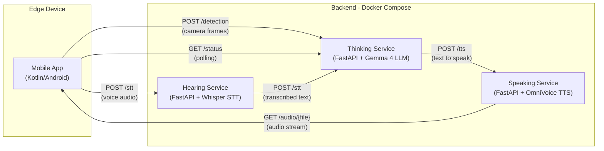

# Adaptive home assistant for people in need (sick, post-op, elder etc.)

An adaptive, AI-based home assistant that monitors people in need living alone. Capabilities:
- complex camera image context analysis (moving beyond basic computer vision object detection / image classification)
- voice interaction - speak/listen to the subject
- daily routine analysis and tracking using a custom model
- complex alerting in case of potential danger, providing context
- intended to be used on EDGE devices, uses quantized, local models, no internet connection required, full confidentiality

## Overview
This research project provides a digitalization framework for managing growing vulnerable populations. The work aligns with my involvement in CiTyInnoHub 2.0, an initiative dedicated to advancing digital transformation, AI education, and technology coaching for startups and state institutions.

The project introduces an adaptive home assistant for vulnerable people living alone, utilizing a phone or tablet. Multiple devices can be deployed within the same household for comprehensive coverage. The software dynamically adjusts its monitoring based on the subject's daily routine to accurately detect anomalies. A microservices-based backend, utilizing exclusively offline models, ensures cost-effectiveness, low latency, and strict data confidentiality.

The Proof of Concept (POC) backend is designed to run on a laptop equipped with an RTX 4080 GPU (12GB VRAM).

## Demo & Real-World Showcase
To see how the application performs in a real-world scenario (including edge detection, LLM reasoning, and TTS), please check the `demo` folder. 

<video src="https://github.com/nastaseeva-cmyk/HomeAssist/blob/main/demo/demo.mp4" controls="controls" width="100%"></video>

You can also explore the raw outputs generated during the demo:
- **Action Logs:** [demo/logs](demo/logs/)
- **Captured Images:** [demo/image/livingroom](demo/images/livingroom/)
- **Generated Audio (TTS):** [demo/audio](demo/audio/)
- **Database:** [demo/db](demo/db/)
- **Resident picture:** [demo/resident](demo/resident/)
- **Demo env:** [demo/config.env](demo/config.env)

## Architecture & Repository Structure
This is a mono-repo containing all required components:

* **`Mobile`**<br>
  Models: MLKit FaceDetection + efficientdet.tflite (person detection) / Silero VAD for voice detection using microphone<br>
  Kotlin application for Android devices. 
  Executes edge-level object detection models on real-time video to filter for relevant frames. 
  Detects voice and sends it to Hearing service for TTS.
  Draws a dynamic basic friendly face - eyes are following the face or person, mouth simulates speaking.
  Validated frames are transmitted to the Thinking endpoint for advanced, multimodal context analysis. 
  The Thinking endpoint analyzes the picture and decides: it either calls the TTS service to retrieve the generated audio URL, or directly replies with its analytical conclusions.
  
* **`Speaking`**<br>
  Model: k2-fsa/OmniVoice<br>
  A Python microservice running a Text-to-Speech (TTS) model. It exposes a REST endpoint that receives text strings, generates synthesized audio, and streams it back to the caller for immediate playback.
  
* **`Thinking`**<br>
  Model: unsloth/gemma-4-E4B-it-GGUF/gemma-4-E4B-it-Q3_K_S.gguf (quantized Google Gemma 4)<br>
  A Python microservice running a multimodal LLM, acting as the system's central processing unit. It exposes a REST endpoint called by the peripheral services (Hearing, ClientApp). It synthesizes context, triggers alerts, and commands the Speaking service.
  
* **`Hearing`**<br>
  Model: fast-whisper/whisper-large-v3<br>
  A Python microservice running a Speech-to-Text (STT) model. Gets voice audio from Mobile and calls Thinking service with detected language and text for further processing.



---

## Surveillance Routines

The system runs five concurrent monitoring routines, combining real-time vision analysis, temporal pattern tracking, and voice interaction.

### 1. Real-Time Scene Analysis (on every frame)

Triggered each time the Mobile app sends a camera frame to `POST /detection`.

The multimodal LLM (Gemma 4) receives **two images** — the resident's reference photo and the live camera frame — along with a structured prompt, and returns a JSON assessment:

| Field | Values | Purpose |
|---|---|---|
| `resident_in_picture` | `yes` / `no` | Is the known resident visible? |
| `multiple_people` | `yes` / `no` | Are there guests or strangers? |
| `status` | `ok` / `danger` / `not_detected` | Safety assessment of the scene |
| `spoken_message` | free text | Context-aware greeting or alert |

Key behaviors:
- The LLM is instructed to **ignore people on screens, paintings, reflections, and mannequins** to prevent false positives.
- It specifically checks for people **lying on the floor, collapsed, or in unusual positions**.
- The `spoken_message` is generated with awareness of today's conversation history to avoid repeating greetings.
- Every frame result is logged to the `routine_logs` database table with timestamp, presence, status, and location.

### 2. Inactive Posture Detection (background, on each frame arrival)

Triggered as a **FastAPI background task** after every `/detection` request.

This routine detects if a person has been in a potentially dangerous static posture (collapsed, unconscious, asleep in an unsafe position) over an extended period. It works by analyzing **3 images spread across the configured inactivity interval** (`INACTIVITY_INTERVAL_SECONDS`, default 2 hours):

```
Image 1 (oldest)          Image 2 (midpoint)          Image 3 (newest)
  ├── interval/2 ago ──────┤── interval/2 ──────────────┤
```

- Selects the **closest available** captured frame to each target timestamp.
- Requires all 3 images to be **distinct files** (prevents checking the same frame 3 times).
- Sends all 3 images to the LLM in a single multimodal prompt asking: *"Is the person maintaining a dangerous inactivity posture continuously across all 3 images?"*
- If the LLM responds with `RESULT: YES`, an `INACTIVE_POSTURE_DETECTED` event is written to the database.

### 3. Daily Routine Anomaly Detection (scheduled loop, every 30 minutes)

Runs as a **persistent async loop** started on server startup — checks every 30 minutes (with a 60-second initial delay).

This routine detects when the resident's absence pattern deviates from their learned daily routine using a two-tier approach:

**Tier 1 — Rule-Based Guards:**
- **Night filter**: Skips checks between 23:00–07:00.
- **Minimum threshold**: Ignores absences under 2 hours.
- **Cold start**: If the resident has never been seen, the check is skipped.
- **Sparse data fallback**: If less than 3 days of data exist, triggers an alert only if the resident has been missing for 8+ hours.

**Tier 2 — ML-Based Anomaly Detection (Isolation Forest):**

When 3+ days of historical data are available, an `IsolationForest` model is trained on-the-fly using features extracted from the `routine_logs` table:

| Feature | Description |
|---|---|
| `hour_of_day` | Time of the observation (continuous, e.g. 14.5 = 2:30 PM) |
| `active_gap` | Hours of *active-time* absence between consecutive sightings (excludes 23:00–07:00 night hours) |

The model predicts whether the current absence is anomalous. A **false-positive override** suppresses the alert if the current gap falls within 1 standard deviation of the historical mean — preventing alerts during normal routines.

When an anomaly is confirmed:
1. An `ROUTINE_ANOMALY_DETECTED` event is logged.
2. The LLM generates a **concerned spoken message** (e.g., *"Are you alright? I haven't seen you in a while."*).
3. The message is synthesized via TTS and played over the home speaker.

### 4. Voice Interaction Monitoring (on incoming speech)

Triggered when the Hearing service forwards transcribed speech to `POST /stt`.

The LLM evaluates what the resident said and determines:
- **Is the resident addressing the assistant?** (vs. talking to someone else or background noise)
- **Status update**: Does the speech indicate danger? (e.g., *"I fell"*, *"I'm not feeling well"*)
- **Spoken response**: A natural, empathetic reply in the resident's configured language.

If danger is detected via speech, an `STT_DANGER_DETECTED` event is written to the database. Only speech in the configured `RESIDENT_LANGUAGE` with 10+ characters is processed (filters out noise and short utterances).

### 5. Conversation Cooldown (1-hour throttle)

When the resident is detected in a normal (`ok`) scenario with no guests, the system applies a **1-hour cooldown** before initiating another spoken interaction. This prevents the assistant from being overly talkative when the resident is simply going about their day at home.

The cooldown is bypassed when `status` is `danger` — the assistant always speaks immediately in emergency situations.

---

## Configuration

Create the configuration files in their respective directories before starting the containers.

**`Thinking/config.env`**
```env
THINKING_HOST = "0.0.0.0"
THINKING_PORT = 7000
LLM_MODEL_PATH = "/etc/models/lmstudio-community/gemma-4-E4B-it-GGUF/gemma-4-E4B-it-Q4_K_M.gguf"
LLM_MMPROJ_PATH = "/etc/models/lmstudio-community/gemma-4-E4B-it-GGUF/mmproj-gemma-4-E4B-it-BF16.gguf"
RESIDENT_IMAGE_PICTURE = "SharedData/resident/yourresidentpic.jpeg"
TTS_HOST = "speaking-service"
TTS_PORT = 9001
THINKING_DB = "SharedData/db/thinking.db"
RESIDENT_LANGUAGE = "en"
INACTIVITY_INTERVAL_SECONDS = 7200
HOMEASSISTANT_NAME = "Assistant"
```

**`Speaking/config.env`**
```env
SPEAKING_HOST = "0.0.0.0"
SPEAKING_PORT = 9001
TTS_MODEL_PATH = "/etc/models/omnivoice"
RESIDENT_LANGUAGE = "en"
```

**`Hearing/config.env`**
```env
HEARING_HOST = "0.0.0.0"
HEARING_PORT = 8000
CORTEX_STT_HOST = "thinking-service"
CORTEX_STT_PORT = 7000
```

---

## Build & Run

To ensure the containers can communicate with each other (e.g., Thinking reaching Speaking via the `TTS_HOST` name, Hearing reaching Thinking via the `CORTEX_STT_HOST`) a dedicated Docker network will be used.
If you plan using docker-compose - put all the configs into a single config.env in the SharedData folder. If you run locally - you can go for dedicated files.

### Run docker compose from the root directory of the repository (`HomeAssist`)
```bash
docker compose up --build
```
At this point, the application backend should be up and running locally. You can install the mobile app and start testing.
